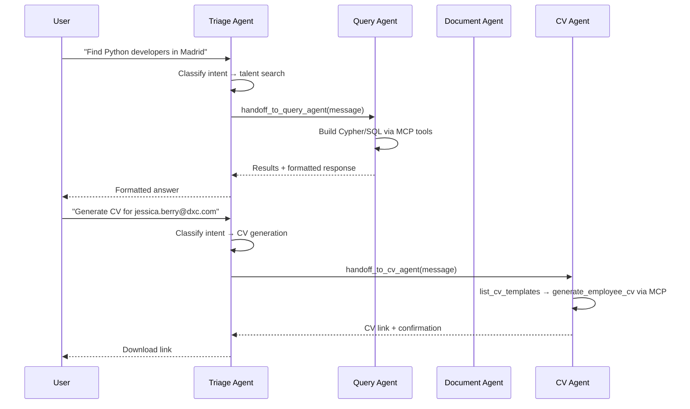

# Agent Orchestration & Handoff Spec

**Author:** Kane (Backend Dev)  
**Date:** 2026-05-10  
**Status:** Living document  
**Source:** [talent_backend/talent_backend/agent/__init__.py](../../talent_backend/talent_backend/agent/__init__.py)

---

## 1. Current State

The TalentIQ backend uses the **agent-as-tool handoff pattern** from `agent_framework` to route user requests through a triage agent to specialist agents. Each specialist has a focused instruction set and its own tool access.

### Architecture Overview

```
User Message
    │
    ▼
┌──────────────┐
│ Triage Agent │  ← routes based on intent
└──────┬───────┘
       │  agent.as_tool() handoff
       ├──────────────────────────────────────┐
       │                                      │
       ▼                                      ▼
┌──────────────────────┐  ┌──────────────────────┐  ┌──────────────────────┐
│ Document Extraction  │  │ Query Agent          │  │ CV Generation Agent  │
│ Agent                │  │                      │  │                      │
│ (no MCP tools)       │  │ (talent_graph_mcp)   │  │ (talent_graph_mcp)   │
└──────────────────────┘  └──────────────────────┘  └──────────────────────┘
```

### Key Components

| Component | File | Role |
|-----------|------|------|
| `TalentIQOrchestrator` | `agent/__init__.py` | Builds agent graph, runs triage |
| `create_orchestrator()` | `agent/__init__.py` | Factory, called during FastAPI lifespan |
| `_read_instructions()` | `agent/__init__.py` | Loads markdown files with `{{GRAPH_NAME}}` substitution |
| Instruction files | `agent/instructions/*.md` | Per-agent system prompts |
| `OpenAIChatCompletionClient` | `agent_framework.openai` | Azure OpenAI via `DefaultAzureCredential` |
| `MCPStreamableHTTPTool` | `agent_framework` | Connects agents to the MCP server |
| `InMemoryHistoryProvider` | `agent_framework` | Per-agent session memory (volatile) |

---

## 2. Agent-as-Tool Handoff Pattern

The handoff pattern wraps each specialist agent as a callable tool available to the triage agent. When the triage agent decides to delegate, it "calls" the specialist as if invoking a function — the framework handles message passing, session propagation, and response aggregation.

### How It Works

```python
# Specialist becomes a tool with a name and description
query_agent.as_tool(
    name="handoff_to_query_agent",
    description="Hand off to the Query Agent to search the talent graph...",
    propagate_session=True,
)
```

**`propagate_session=True`** ensures the specialist agent receives the same `AgentSession` as the triage agent. This means:
- The specialist can read the full conversation context
- Session-level state (session_id) is shared
- History providers attached to the specialist accumulate messages within the same session scope

### Handoff Decision Flow



### Triage Agent Routing Logic

The triage agent uses its instruction file (`TRIAGE_AGENT.md`) to classify user intent. Routing is based on natural language understanding — no regex or rules engine. The triage agent decides which specialist to invoke based on the conversation context.

| Intent | Handoff Target | Tool Name |
|--------|---------------|-----------|
| Document analysis, RFP parsing | Document Extraction Agent | `handoff_to_document_agent` |
| Talent search, graph queries, employee lookup | Query Agent | `handoff_to_query_agent` |
| CV/resume generation, template selection | CV Generation Agent | `handoff_to_cv_agent` |
| General questions, greetings, clarification | Triage handles directly | (no handoff) |

---

## 3. Agent Lifecycle

### Initialization

```python
# Called once during FastAPI lifespan (api.py)
_agent = await create_orchestrator()
```

1. `TalentIQOrchestrator.__init__()` — empty state
2. `initialize()`:
   - Creates `DefaultAzureCredential` (shared across all clients)
   - Creates `OpenAIChatCompletionClient` per agent (each gets its own client instance)
   - Creates `MCPStreamableHTTPTool` pointing to MCP server (`MCP_ENDPOINT`)
   - Creates `InMemoryHistoryProvider` per agent
   - Reads instruction markdown files with `{{GRAPH_NAME}}` substitution
   - Builds specialist agents: Document, Query, CV
   - Wraps specialists as tools via `.as_tool()`
   - Builds triage agent with specialist tools
3. Logs: model name, MCP endpoint, graph name

### Session Binding

```python
session = AgentSession(session_id=session_id) if session_id else None
return self._triage_agent.run(messages, stream=stream, session=session)
```

- `session_id` comes from the API layer (generated or passed by the client)
- If no session_id, no session object is passed (stateless mode)
- Session is passed to `triage_agent.run()` — propagated to specialists via `propagate_session=True`

### Execution & Streaming

```python
result = await _agent.run(messages, stream=True)
async for event in result:
    if isinstance(event, AgentResponseUpdate):
        # Streaming token delta — partial text
    elif isinstance(event, AgentResponse):
        # Complete response with full messages
```

The streaming protocol emits two event types:

| Event Type | Contents | When |
|-----------|----------|------|
| `AgentResponseUpdate` | `.text` — partial token delta | During generation |
| `AgentResponse` | `.messages` — list of complete messages | At completion |

---

## 4. Message Flow

### API Layer → Agent

```python
# api.py: _build_chat_history()
messages, session_id = _build_chat_history(req.session_id, req.input)
```

1. User message stored in Cosmos DB via `ChatHistoryStore.add_message()`
2. Recent history retrieved (capped at 20 messages)
3. History converted to `Message(role=..., contents=[text])` list
4. Messages passed to `orchestrator.run(messages, session_id=session_id)`

### Special Message Augmentation

The API layer augments messages before passing to the agent in two cases:

1. **File context** — document content embedded in user message with `---BEGIN DOCUMENT---` markers
2. **CV template choice** — short replies (e.g., "1", "default") augmented to full CV generation requests using `_augment_cv_template_choice()`

This augmentation happens at the API layer, **not** in agent instructions, for reliability.

---

## 5. Agent Instruction System

### File Structure

```
talent_backend/talent_backend/agent/instructions/
├── TRIAGE_AGENT.md
├── TALENT_GRAPH_QUERY_GENERATION_AGENT_v1.md
├── DOCUMENT_EXTRACTION_AGENT.md
└── CV_GENERATION_AGENT.md
```

### Template Substitution

```python
def _read_instructions(filename: str) -> str:
    text = path.read_text(encoding="utf-8-sig")
    return text.replace("{{GRAPH_NAME}}", GRAPH_NAME).replace("{GRAPH_NAME}", GRAPH_NAME)
```

- `{{GRAPH_NAME}}` → value of `GRAPH_NAME` env var (default: `talent_graph`)
- Both `{{GRAPH_NAME}}` and `{GRAPH_NAME}` are replaced (handles inconsistent template syntax)
- Files read with `utf-8-sig` encoding (BOM-safe)
- `FileNotFoundError` raised if instruction file missing

---

## 6. Adding a New Specialist Agent

### Step-by-Step

1. **Write the instruction file**:
   ```
   agent/instructions/NEW_AGENT.md
   ```
   Include the agent's role, available tools, response format, and constraints.

2. **Create the agent** in `TalentIQOrchestrator.initialize()`:
   ```python
   new_instructions = _read_instructions("NEW_AGENT.md")
   new_agent = Agent(
       name="new_agent",
       description="One-line description for the triage agent to understand when to route here.",
       instructions=new_instructions,
       client=_make_client(),
       tools=mcp_tool,  # or omit if agent doesn't need MCP
       middleware=[InMemoryHistoryProvider()],
   )
   ```

3. **Register as a handoff tool**:
   ```python
   specialist_tools.append(
       new_agent.as_tool(
           name="handoff_to_new_agent",
           description="Hand off to New Agent for [specific task description].",
           propagate_session=True,
       ),
   )
   ```

4. **Update the triage agent instructions** (`TRIAGE_AGENT.md`) to include the new agent in its routing logic.

5. **Update `__init__.py` docstring** to reflect the new specialist.

---

## 7. Error Handling

### Current Behavior

| Failure | Handling |
|---------|----------|
| Agent raises exception | Caught in `_stream_agent()` / `_stream_graph()`, emits SSE `error` event |
| MCP server unreachable | Agent framework raises connection error → caught at API layer |
| OpenAI rate limit / timeout | Propagated as exception → SSE error event |
| Instruction file missing | `FileNotFoundError` at initialization — server won't start |
| Orchestrator not initialized | `RuntimeError("Orchestrator not initialized")` |

### Improvement Targets

| Area | Current | Target |
|------|---------|--------|
| Retry on transient failures | None | Configurable retry with exponential backoff (agent_framework level) |
| Timeout per agent | None | Per-agent execution timeout (30s default, 120s for CV generation) |
| Circuit breaker | None | MCP connection circuit breaker — fallback to "service unavailable" message |
| Partial failure | Full failure if specialist fails | Triage should report specialist failure gracefully |

---

## 8. Streaming Protocol Detail

### SSE Format (POST /api/chat)

```
event: start
data: {"id": "msg_abc123", "session_id": "xyz789"}

event: delta
data: {"id": "msg_abc123", "text": "I found "}

event: delta
data: {"id": "msg_abc123", "text": "3 Python developers"}

event: message
data: {"id": "msg_abc123", "role": "assistant", "text": "I found 3 Python developers..."}

event: done
data: {"id": "msg_abc123", "session_id": "xyz789"}
```

### NDJSON Format (POST /af/graph/responses)

```jsonl
{"response_message": {"type": "OrchestratorEvent", "delta": "[HANDOFF] → Query Agent"}}
{"response_message": {"type": "AgentEvent", "delta": "[QUERY] CYPHER: MATCH (e:Employee)..."}}
{"response_message": {"type": "AgentEvent", "delta": "[RESULT] CYPHER returned 5 rows (42ms)"}}
{"response_message": {"type": "WorkflowOutputEvent", "delta": "I found 5 developers..."}}
{"response_message": {"type": "done"}}
```

The NDJSON endpoint captures `agent_framework` log messages via a custom log handler (`_AgentLogHandler`) to surface tool calls and handoffs in the frontend run log panel.

---

## 9. Target State

### Multi-Turn Agent Conversations

Currently each `run()` call is independent — the agent sees history from Cosmos but has no persistent memory. Target:

- **Agent memory**: per-session working memory stored alongside chat history
- **Context window management**: automatic summarization when token budget exceeded
- **Conversation state**: agents can track multi-step workflows (e.g., "first search, then generate CV")

### Additional Specialist Agents (Planned)

| Agent | Purpose | MCP Tools |
|-------|---------|-----------|
| Scoring Agent | Score candidates against RFP requirements | `scoring_tool` |
| Shortlist Agent | Build and manage candidate shortlists | `shortlist_tool` |
| Notification Agent | Send alerts for bench status changes | `notification_tool` |
| Export Agent | Generate Excel/PDF reports | `export_tool` |

### Migration Path

1. **Phase 1 (Current)**: Agent-as-tool pattern with 3 specialists, InMemoryHistoryProvider
2. **Phase 2**: Cosmos-backed HistoryProvider (see `session-management.md`), add Scoring Agent
3. **Phase 3**: Multi-turn workflow state, Shortlist + Notification agents
4. **Phase 4**: Context window management, agent memory, cross-session learning

---

## 10. Configuration Reference

| Variable | Source | Default | Purpose |
|----------|--------|---------|---------|
| `AZURE_OPENAI_ENDPOINT` | `app_config/.env` | (required) | Azure OpenAI endpoint |
| `AZURE_OPENAI_CHAT_DEPLOYMENT_NAME` | `app_config/.env` | (required) | Chat model deployment name |
| `MCP_ENDPOINT` | `app_config/.env` | `http://localhost:3002/mcp` | MCP server URL |
| `GRAPH_NAME` | `app_config/.env` | `talent_graph` | AGE graph name for template substitution |
