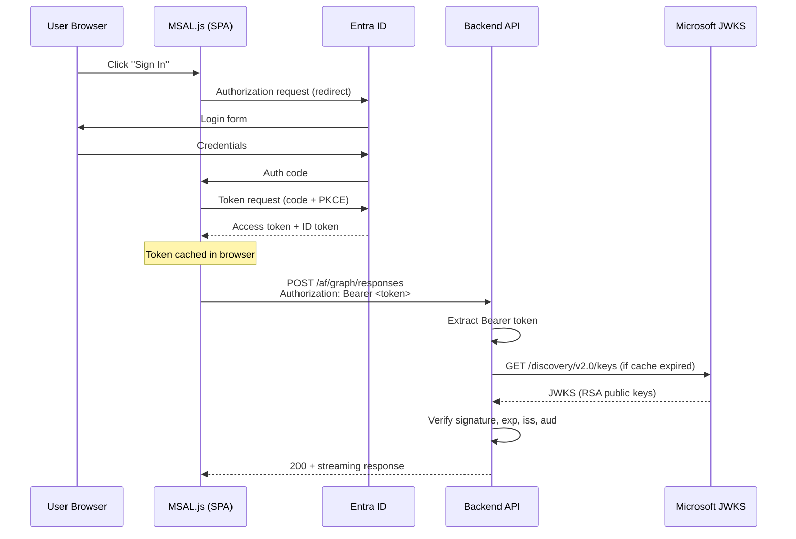

# Authentication Spec

**Author:** Kane (Backend Dev)  
**Date:** 2026-05-10  
**Status:** Living document  
**Source:** [talent_backend/talent_backend/auth.py](../../talent_backend/talent_backend/auth.py)

---

## 1. Current State

### Implementation: auth.py

Entra ID JWT validation as a FastAPI dependency. Dev mode bypass when tenant is not configured.

```python
# Applied to all endpoints except /health
async def get_current_user(request: Request) -> dict[str, str | None]:
    # Returns {"oid": ..., "name": ..., "email": ...}
```

### What Works

| Feature | Status | Notes |
|---------|--------|-------|
| JWT signature validation | Working | RS256 via JWKS from Microsoft endpoint |
| JWKS caching | Working | 1-hour TTL, refreshed automatically |
| Token expiry check | Working | `verify_exp: True` |
| v1 + v2 issuer support | Working | Both `sts.windows.net` and `login.microsoftonline.com/v2.0` |
| Dual audience | Working | Accepts `https://ai.azure.com` and app client ID |
| Dev mode bypass | Working | When `AZURE_TENANT_ID` not set, returns synthetic user |
| JWKS key matching | Working | Matches `kid` header to JWKS keys |

### Configuration

| Variable | Value | Source |
|----------|-------|--------|
| `AZURE_TENANT_ID` | `150305b3-cc4b-46dd-9912-425678db1498` | `app_config/.env` |
| `AZURE_CLIENT_ID` | `48449491-8390-4af0-8121-da7af091ad56` | `app_config/.env` (as `ENTRA_SPA_CLIENT_ID`) |
| `AZURE_TOKEN_AUDIENCE` | `https://ai.azure.com` | `app_config/.env` |

---

## 2. Token Flow

### End-to-End Authentication



### Frontend (MSAL) Configuration

**File:** `talent_ui/src/authConfig.js`

```javascript
const msalConfig = {
    auth: {
        clientId: "48449491-8390-4af0-8121-da7af091ad56",
        authority: "https://login.microsoftonline.com/150305b3-cc4b-46dd-9912-425678db1498",
        redirectUri: "http://localhost:5173",
    }
};

const loginRequest = {
    scopes: ["https://ai.azure.com/user_impersonation"]
};
```

### Token Acquisition

```javascript
// Silent acquisition (preferred — uses cached token)
const response = await msalInstance.acquireTokenSilent(loginRequest);
const token = response.accessToken;

// Attach to API calls
fetch("/af/graph/responses", {
    headers: { "Authorization": `Bearer ${token}` }
});
```

---

## 3. JWKS Caching & Rotation

### Current Implementation

```python
_jwks_cache: dict | None = None
_jwks_fetched_at: float = 0.0
_JWKS_TTL_SECONDS: float = 3600  # 1 hour

async def _get_signing_keys() -> dict:
    now = time.monotonic()
    if _jwks_cache is not None and (now - _jwks_fetched_at) < _JWKS_TTL_SECONDS:
        return _jwks_cache
    # Fetch from Microsoft endpoint
    async with httpx.AsyncClient(timeout=10) as client:
        resp = await client.get(_jwks_url())
        ...
```

### Key Rotation Handling

- Microsoft rotates signing keys periodically (typically every 6 weeks)
- 1-hour cache TTL means we'll pick up new keys within 1 hour of rotation
- If a token is signed with an unknown `kid`, the current code returns 401 immediately
- **Improvement target:** On `kid` mismatch, force-refresh JWKS once before rejecting

```python
# Target: retry with fresh JWKS on kid mismatch
rsa_key = _find_rsa_key(token, jwks)
if rsa_key is None:
    jwks = await _force_refresh_jwks()
    rsa_key = _find_rsa_key(token, jwks)
    if rsa_key is None:
        raise HTTPException(401, "Token signing key not found")
```

---

## 4. Token Audience Handling

### The Problem (Documented Learning)

When using `https://ai.azure.com/user_impersonation` as the scope, the token's `aud` claim is `https://ai.azure.com` — **not** the SPA's client ID. This is because `https://ai.azure.com` is the **resource** being accessed.

### Current Solution

```python
valid_audiences = [a for a in [AZURE_TOKEN_AUDIENCE, AZURE_CLIENT_ID] if a]

payload = jwt.decode(
    token,
    ...
    audience=valid_audiences or None,
    options={"verify_aud": bool(valid_audiences)},
)
```

Both audiences accepted:
1. `https://ai.azure.com` — tokens acquired with Foundry scope
2. `48449491-8390-4af0-8121-da7af091ad56` — tokens acquired with app-specific scope (future)

---

## 5. v1 vs v2 Issuer Format

### The Problem (Production Fix)

Microsoft issues tokens with **v1 issuer format** when the resource (`aud`) is registered as a v1 application. `https://ai.azure.com` is a v1 resource.

| Issuer Version | Format |
|---------------|--------|
| v1 | `https://sts.windows.net/{tenant}/` |
| v2 | `https://login.microsoftonline.com/{tenant}/v2.0` |

### Current Solution

```python
def _issuers() -> list[str]:
    return [
        f"https://login.microsoftonline.com/{AZURE_TENANT_ID}/v2.0",
        f"https://sts.windows.net/{AZURE_TENANT_ID}/",
    ]

# JWT decode with manual issuer validation
payload = jwt.decode(
    token,
    options={"verify_iss": False},  # skip built-in check
)

# Manual check against both formats
token_issuer = payload.get("iss", "")
if token_issuer not in _issuers():
    raise HTTPException(401, "Invalid token issuer")
```

**Key learning:** This is Microsoft platform behavior, not a configuration issue. When the resource scope is `https://ai.azure.com/user_impersonation`, tokens will always use v1 issuer format. Both formats must be accepted.

---

## 6. Authorization Model

### Current: Authentication Only

Any valid Entra ID token grants full access to all endpoints. No role checking.

```python
# Current — authentication only
@app.post("/af/graph/responses")
async def graph_responses(req: ChatRequest, user: dict = Depends(get_current_user)):
    # user dict has oid, name, email — but no role info
    ...
```

### Target: RBAC with App Roles

#### Entra ID App Role Definitions

Define roles in the app registration manifest:

```json
{
    "appRoles": [
        {
            "id": "a1b2c3d4-...",
            "allowedMemberTypes": ["User"],
            "displayName": "Manager",
            "value": "Manager",
            "description": "Can search talent, generate CVs, manage shortlists"
        },
        {
            "id": "e5f6g7h8-...",
            "allowedMemberTypes": ["User"],
            "displayName": "PreSales",
            "value": "PreSales",
            "description": "Can search talent, generate CVs, process RFPs"
        },
        {
            "id": "i9j0k1l2-...",
            "allowedMemberTypes": ["User"],
            "displayName": "Admin",
            "value": "Admin",
            "description": "Full access including user management and analytics"
        },
        {
            "id": "m3n4o5p6-...",
            "allowedMemberTypes": ["User"],
            "displayName": "Viewer",
            "value": "Viewer",
            "description": "Read-only access to search results"
        }
    ]
}
```

#### Role Extraction from Token

```python
async def get_current_user(request: Request) -> dict:
    ...
    user = {
        "oid": payload.get("oid"),
        "name": payload.get("name"),
        "email": payload.get("preferred_username"),
        "roles": payload.get("roles", []),  # App roles from Entra ID
    }
    return user
```

#### Role-Based Endpoint Access (Decorator Pattern)

```python
from functools import wraps

def require_role(*allowed_roles: str):
    """FastAPI dependency that checks user has at least one of the allowed roles."""
    async def _check(user: dict = Depends(get_current_user)):
        user_roles = set(user.get("roles", []))
        if not user_roles.intersection(allowed_roles):
            raise HTTPException(403, "Insufficient permissions")
        return user
    return _check

# Usage
@app.post("/af/graph/responses")
async def graph_responses(
    req: ChatRequest,
    user: dict = Depends(require_role("Manager", "PreSales", "Admin")),
):
    ...

@app.delete("/api/threads/{thread_id}")
async def delete_thread(
    thread_id: str,
    user: dict = Depends(require_role("Admin")),
):
    ...
```

#### Role-to-Endpoint Matrix

| Endpoint | Viewer | Manager | PreSales | Admin |
|----------|--------|---------|----------|-------|
| `POST /af/graph/responses` | Read-only results | Full | Full | Full |
| `POST /af/upload` | No | Yes | Yes | Yes |
| `GET /api/threads` | Own only | Own only | Own only | All |
| `DELETE /api/threads/{id}` | No | Own only | Own only | Any |
| `GET /health` | Public | Public | Public | Public |
| `GET /admin/analytics` | No | No | No | Yes |

---

## 7. Backend-to-Azure Service Auth

### Current: DefaultAzureCredential

All backend-to-Azure connections use `DefaultAzureCredential`:

| Service | Auth Target | Credential |
|---------|-------------|------------|
| Azure OpenAI | Chat completions, embeddings | `DefaultAzureCredential` |
| Cosmos DB | Chat history, sessions | `DefaultAzureCredential` |
| PostgreSQL | Graph queries | Password-based (connection string) |

### Credential Chain

`DefaultAzureCredential` tries providers in order:

| # | Provider | Environment |
|---|----------|-------------|
| 1 | EnvironmentCredential | CI/CD (env vars) |
| 2 | WorkloadIdentityCredential | Kubernetes |
| 3 | ManagedIdentityCredential | Azure App Service, ACA |
| 4 | AzureCliCredential | Local dev |
| 5 | AzurePowerShellCredential | Local dev (fallback) |

### Production Target: Managed Identity

In production (Azure Container Apps or App Service):

```
Backend → Managed Identity → Azure OpenAI
Backend → Managed Identity → Cosmos DB
Backend → Managed Identity → PostgreSQL (Entra ID auth — see azure-postgres skill)
```

No secrets stored in environment. All auth via Entra ID.

### Token Forwarding

The backend does **not** forward user tokens to downstream services. Each service connection uses the backend's own identity (Managed Identity in prod, CLI credential in dev).

The user's identity (`oid`, `email`, `roles`) is used for:
- Authorization decisions (role checks)
- Audit logging (who queried what)
- Data filtering (user owns their threads)

---

## 8. Security Headers & Rate Limiting

### Current Security Headers

```python
# CORS only — via FastAPI middleware
app.add_middleware(
    CORSMiddleware,
    allow_origins=["http://localhost:3000", "http://localhost:5173", ...],
    allow_methods=["GET", "POST"],
    allow_headers=["*"],
)
```

### Target Security Headers

```python
from starlette.middleware import Middleware
from starlette.middleware.trustedhost import TrustedHostMiddleware

# Production middleware stack
app.add_middleware(TrustedHostMiddleware, allowed_hosts=["talentiq.azurewebsites.net", "localhost"])

@app.middleware("http")
async def security_headers(request, call_next):
    response = await call_next(request)
    response.headers["X-Content-Type-Options"] = "nosniff"
    response.headers["X-Frame-Options"] = "DENY"
    response.headers["Strict-Transport-Security"] = "max-age=31536000; includeSubDomains"
    response.headers["Cache-Control"] = "no-store"
    return response
```

### Rate Limiting (Target)

```python
# Per-user rate limiting (using slowapi or custom middleware)
RATE_LIMITS = {
    "/af/graph/responses": "30/minute",
    "/af/upload": "10/minute",
    "/api/threads": "60/minute",
}
```

---

## 9. Dev Mode vs Production Mode

### Toggle

```python
# Dev mode activates when AZURE_TENANT_ID is not set
if not AZURE_TENANT_ID:
    logger.warning("AZURE_TENANT_ID not set — auth is DISABLED (dev mode)")
    return {"oid": "dev-user", "name": "Dev User", "email": "dev@localhost"}
```

### Behavior Comparison

| Aspect | Dev Mode | Production |
|--------|----------|------------|
| Auth validation | Skipped | Full JWT validation |
| User identity | Synthetic `dev-user` | From token claims |
| CORS | Localhost origins | Production domain only |
| JWKS fetch | Never | Cached, 1-hour TTL |
| Rate limiting | Disabled | Enabled |
| Security headers | Minimal | Full set |
| Logging | Verbose | Structured, no PII |

### Env Var Summary

| Variable | Dev | Production |
|----------|-----|------------|
| `AZURE_TENANT_ID` | (unset) | `150305b3-...` |
| `ENTRA_SPA_CLIENT_ID` | (optional) | `48449491-...` |
| `AZURE_TOKEN_AUDIENCE` | (optional) | `https://ai.azure.com` |

---

## 10. Migration Path

| Phase | Change |
|-------|--------|
| 1 (Current) | Authentication only, dev mode bypass |
| 2 | Extract roles from token, add `require_role()` dependency |
| 3 | Define app roles in Entra ID, assign to users |
| 4 | Apply role guards to sensitive endpoints |
| 5 | Add security headers, rate limiting |
| 6 | PostgreSQL Entra ID auth (replace password with Managed Identity) |
| 7 | Audit logging with user identity |

### Configuration Additions (Target)

| Variable | Default | Purpose |
|----------|---------|---------|
| `RATE_LIMIT_ENABLED` | `false` | Enable rate limiting |
| `RATE_LIMIT_PER_MINUTE` | `30` | Default per-user rate limit |
| `ALLOWED_HOSTS` | `localhost` | Trusted host whitelist |
| `RBAC_ENABLED` | `false` | Enable role-based access control |
