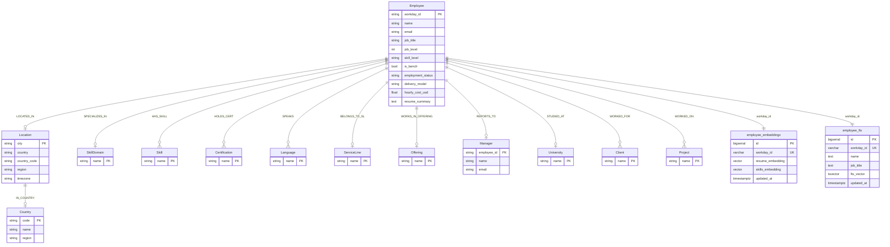
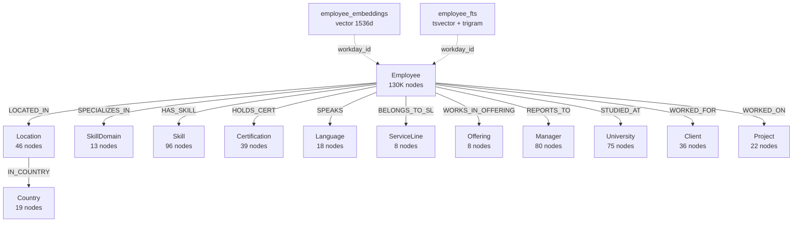

# Database Architecture Specification

**Project:** TalentIQ — Talent Matching & Search Platform  
**Author:** Parker (Data Engineer)  
**Date:** 2026-05-10  
**Status:** Living document — reflects current implementation + target state  

---

## Table of Contents

1. [Architecture Overview](#1-architecture-overview)
2. [Graph Database (PostgreSQL + Apache AGE)](#2-graph-database-postgresql--apache-age)
3. [Vector Search (DiskANN on PostgreSQL)](#3-vector-search-diskann-on-postgresql)
4. [Full-Text Search (tsvector)](#4-full-text-search-tsvector)
5. [Relational Tables](#5-relational-tables)
6. [Data Pipeline](#6-data-pipeline)
7. [Production Readiness](#7-production-readiness)
8. [Query Security](#8-query-security)
9. [ER Diagram](#9-er-diagram)

---

## 1. Architecture Overview

TalentIQ uses a unified PostgreSQL instance augmented with three query paradigms:

| Layer | Technology | Purpose |
|-------|-----------|---------|
| Graph | PostgreSQL + Apache AGE | Relationship traversal (skills, teams, org hierarchy) |
| Vector | pgvector + DiskANN/HNSW | Semantic similarity search (resume/skills matching) |
| Full-Text | tsvector + GIN + pg_trgm | Keyword search, fuzzy name matching |
| Relational | Standard PostgreSQL tables | Embedding storage, FTS materialization, joins |

**Query flow:**

```
User → UI → Backend API → AI Agent (Agent Framework SDK)
  → MCP Server (FastMCP, port 3002)
    → PGAgeHelper (AsyncConnectionPool)
      → PostgreSQL + AGE
```

The MCP server exposes three tool functions to the agent:
- `query_using_sql_cypher` — arbitrary SQL/Cypher execution
- `search_graph` — full-text search across graph nodes
- `vector_search` — semantic similarity via embeddings

Structured search endpoints (`/api/v1/search/*`) also query the same database via a data access layer in `talent_backend/talent_backend/data_access/`.

### Current State

- Single PostgreSQL instance (Azure Database for PostgreSQL Flexible Server)
- AGE extension for graph storage
- pgvector extension for vector indexing
- 130,000 employee nodes, 14 node labels, 12 edge labels
- ~1.8M total edges
- Synthetic data pipeline for dev/test

### Target State

- Production Workday data ingestion replacing synthetic data
- Hybrid search (vector + graph + FTS combined ranking)
- Read replicas for search-heavy workloads
- Incremental embedding updates on employee data changes
- Connection pooling tuned for concurrent agent sessions

---

## 2. Graph Database (PostgreSQL + Apache AGE)

### 2.1 Schema Overview

#### Node Labels (14)

| Label | Count | Key Property | Properties |
|-------|-------|-------------|------------|
| **Employee** | 130,000 | `workday_id` | `name`, `first_name`, `last_name`, `email`, `phone`, `workday_id`, `job_title`, `job_level` (int 3–14), `skill_level` (Junior/Mid/Senior/Lead/Principal/Architect), `hire_date`, `years_of_experience`, `employment_status` (Active/Bench/Notice Period/Long-term Leave), `is_bench` (bool), `bench_start_date`, `bench_duration_days`, `availability_date`, `current_project`, `fte_current_month` (%), `fte_next_month`, `fte_next2_month`, `hourly_cost_usd`, `bill_rate_usd`, `cv_last_updated`, `cv_freshness_days`, `cv_source`, `impressiveness_score` (0–100), `data_source`, `delivery_model` (onshore/nearshore/offshore), `eqf_level` (5–8), `meces_level` (1–4), `education_degree`, `education_field`, `resume_summary` |
| **Location** | 46 | `city` | `city`, `country`, `country_code`, `region`, `subregion`, `zip`, `address`, `timezone`, `delivery_model` |
| **Country** | 19 | `code` | `name`, `code`, `region` |
| **Subregion** | 15 | `name` | `name`, `region` |
| **Skill** | 96 | `name` | `name` |
| **SkillDomain** | 13 | `name` | `name` (Python, Java, C#/.NET, JavaScript/TS, Cloud (Azure), Cloud (AWS), DevOps/SRE, Data Engineering, AI/ML, SAP, Salesforce, Cybersecurity, ServiceNow) |
| **Certification** | 39 | `name` | `name` |
| **Language** | 18 | `name` | `name` |
| **ServiceLine** | 8 | `name` | `name` |
| **Offering** | 8 | `name` | `name` |
| **Manager** | 80 | `employee_id` | `name`, `email`, `employee_id` |
| **University** | 75 | `name` | `name` |
| **Client** | 36 | `name` | `name` |
| **Project** | 22 | `name` | `name` |

#### Edge Labels (12)

| Edge Label | From → To | Cardinality | Properties |
|-----------|-----------|-------------|------------|
| `LOCATED_IN` | Employee → Location | 130K (1:1) | — |
| `IN_COUNTRY` | Location → Country | 46 (1:1) | — |
| `SPECIALIZES_IN` | Employee → SkillDomain | 130K (1:1) | — |
| `HAS_SKILL` | Employee → Skill | ~714K (avg 5.5/emp) | `level`, `years_of_experience`, `active`, `is_primary` |
| `HOLDS_CERT` | Employee → Certification | ~183K (avg 1.4/emp) | `issue_date`, `expiry_date`, `status` (Valid/Expiring/Expired), `credential_id`, `has_evidence` |
| `SPEAKS` | Employee → Language | ~261K (avg 2/emp) | `level` (CEFR: A1–C2), `is_native` |
| `BELONGS_TO_SL` | Employee → ServiceLine | 130K (1:1) | — |
| `WORKS_IN_OFFERING` | Employee → Offering | 130K (1:1) | — |
| `REPORTS_TO` | Employee → Manager | 130K (1:1) | — |
| `STUDIED_AT` | Employee → University | 130K (1:1) | `degree`, `field`, `graduation_year`, `eqf_level`, `meces_level` |
| `WORKED_FOR` | Employee → Client | ~336K (avg 2.6/emp) | `role`, `project`, `start_date`, `end_date`, `is_current` |
| `WORKED_ON` | Employee → Project | ~336K (avg 2.6/emp) | `role`, `start_date`, `end_date` |

**Estimated totals:** ~130,360 nodes, ~1,870,000 edges.

### 2.2 AGE Integration

#### ag_catalog.cypher() SQL Wrapping

All Cypher queries execute through the `ag_catalog.cypher()` SQL function. AGE requires the search path to include `ag_catalog`:

```sql
SET search_path = ag_catalog, "$user", public;

SELECT * FROM ag_catalog.cypher('talent_graph', $$
  MATCH (e:Employee {workday_id: 'WD-100001'})
  RETURN e
$$) AS (result agtype);
```

The `PGAgeHelper.query_using_sql_cypher()` method sets the search path before every query:

```python
async with self._pool.connection() as conn:
    async with conn.cursor(row_factory=dict_row) as cur:
        await cur.execute('SET search_path = ag_catalog, "$user", public;')
        await cur.execute(sql)
```

#### agtype Result Parsing

AGE returns values as the custom `agtype` type. The `_parse_agtype_value()` function handles:

| AGE Output | Parsed Result | Method |
|-----------|---------------|--------|
| `"some text"` | `some text` (str) | Strip quotes |
| `123` | `123` (int) | Numeric parse |
| `12.5::numeric` | `12.5` (float) | Strip `::type` suffix, parse |
| `true`/`false` | `True`/`False` (bool) | Literal match |
| `["Label"]` | `Label` (str) | JSON array label unwrap |
| `{...}` | dict | JSON parse |

The `strip_agtype()` helper specifically handles label arrays (`["Employee"]` → `Employee`).

#### Cypher Query Patterns

**Pattern 1: Find employees by skill and location**
```sql
SELECT * FROM ag_catalog.cypher('talent_graph', $$
  MATCH (e:Employee)-[:HAS_SKILL]->(s:Skill {name: 'Python'}),
        (e)-[:LOCATED_IN]->(l:Location {city: 'Bangalore'})
  WHERE e.payload.is_bench = true
  WITH e.payload.name AS name, e.payload.workday_id AS wid,
       e.payload.skill_level AS level
  RETURN name, wid, level
  ORDER BY level DESC
  LIMIT 20
$$) AS (name agtype, wid agtype, level agtype);
```

**Pattern 2: Aggregation with WITH (AGE-specific requirement)**
```sql
-- WRONG (AGE does not support ORDER BY on aggregation in RETURN):
--   RETURN c.payload.name AS country, count(e) AS cnt ORDER BY cnt DESC

-- CORRECT:
SELECT * FROM ag_catalog.cypher('talent_graph', $$
  MATCH (e:Employee)-[:LOCATED_IN]->(l:Location)-[:IN_COUNTRY]->(c:Country)
  WITH c.payload.name AS country, count(e) AS cnt
  RETURN country, cnt
  ORDER BY cnt DESC
$$) AS (country agtype, cnt agtype);
```

**Pattern 3: Multi-hop traversal with property forwarding**
```sql
SELECT * FROM ag_catalog.cypher('talent_graph', $$
  MATCH (e:Employee)-[hs:HAS_SKILL]->(s:Skill),
        (e)-[:LOCATED_IN]->(l:Location)-[:IN_COUNTRY]->(c:Country)
  WHERE hs.payload.level = 'Expert'
    AND c.payload.code = 'IN'
  WITH e.payload.name AS name, s.payload.name AS skill,
       l.payload.city AS city
  RETURN name, skill, city
  LIMIT 50
$$) AS (name agtype, skill agtype, city agtype);
```

**Pattern 4: Graph statistics**
```sql
SELECT * FROM ag_catalog.cypher('talent_graph', $$
  MATCH (n) RETURN labels(n) AS label, count(*) AS cnt
$$) AS (label agtype, cnt agtype);

SELECT * FROM ag_catalog.cypher('talent_graph', $$
  MATCH ()-[r]->() RETURN type(r) AS rel, count(*) AS cnt
$$) AS (rel agtype, cnt agtype);
```

### 2.3 AGE Query Rules

Critical rules enforced in the ontology prompt given to the AI agent:

1. **WITH before ORDER BY on aggregation** — AGE requires `WITH` to forward aggregated values before `RETURN ... ORDER BY`.
2. **Property access via `payload.*`** — All node/edge properties are under the `payload` namespace (e.g., `e.payload.name`).
3. **3-WITH chain limit** — Queries with more than 3 sequential `WITH` clauses degrade in performance; restructure as subqueries.
4. **Cartesian product prevention** — Always ensure `MATCH` patterns are connected; unconnected patterns produce cross-joins.
5. **Column aliasing in AS clause** — Every column in the `ag_catalog.cypher()` call must be aliased in the `AS` clause with `agtype` type.

### 2.4 Index Strategy for Graph

AGE stores each label as a table under the graph schema (`talent_graph."Employee"`, `talent_graph."Skill"`, etc.). Properties are stored as `agtype`, not `jsonb`.

**Property indexes use `ag_catalog.agtype_access_operator()`:**

```sql
CREATE INDEX idx_emp_workday_id
  ON talent_graph."Employee"
  ((ag_catalog.agtype_access_operator(properties, '"workday_id"'::agtype)));
```

| Index Name | Label | Property | Purpose |
|-----------|-------|----------|---------|
| `idx_emp_workday_id` | Employee | `workday_id` | Primary lookup |
| `idx_emp_email` | Employee | `email` | Email search |
| `idx_emp_is_bench` | Employee | `is_bench` | Bench filtering |
| `idx_emp_status` | Employee | `employment_status` | Status filtering |
| `idx_emp_skill_level` | Employee | `skill_level` | Level filtering |
| `idx_emp_job_level` | Employee | `job_level` | Level filtering |
| `idx_emp_delivery_model` | Employee | `delivery_model` | Delivery model filtering |
| `idx_loc_city` | Location | `city` | Location lookup |
| `idx_skill_name` | Skill | `name` | Skill lookup |
| `idx_skilldomain_name` | SkillDomain | `name` | Domain lookup |
| `idx_cert_name` | Certification | `name` | Cert lookup |
| `idx_lang_name` | Language | `name` | Language lookup |
| `idx_sl_name` | ServiceLine | `name` | Service line lookup |
| `idx_offering_name` | Offering | `name` | Offering lookup |
| `idx_mgr_empid` | Manager | `employee_id` | Manager lookup |
| `idx_uni_name` | University | `name` | University lookup |
| `idx_client_name` | Client | `name` | Client lookup |
| `idx_project_name` | Project | `name` | Project lookup |
| `idx_country_code` | Country | `code` | Country lookup |

### 2.5 Connection Pooling

```
PGAgeHelper (async, psycopg3)
├── AsyncConnectionPool (psycopg_pool)
│   ├── min_size: 2 (default)
│   ├── max_size: 10 (default)
│   ├── row_factory: dict_row
│   └── conninfo: from pg_conninfo() (host, port, dbname, user, password, sslmode)
└── Deferred open: pool created at startup, opened on first query
```

**Current configuration:**
- `min_size=2`: minimum idle connections
- `max_size=10`: maximum concurrent connections
- Connection string built from `PGHOST`, `PGPORT`, `PGDATABASE`, `PGUSER`, `PGPASSWORD`, `PGSSLMODE` env vars
- SSL required by default (`sslmode=require`)

**Target configuration for production:**
- `min_size=5`, `max_size=25` for concurrent agent sessions
- Connection health checks enabled
- Statement timeout: 30s for queries, 5min for data loads

### 2.6 Known Limitations of AGE vs Native Neo4j

| Feature | Neo4j | AGE (PostgreSQL) | Impact |
|---------|-------|------------------|--------|
| **Query optimizer** | Native graph optimizer | SQL-based, limited graph awareness | Complex traversals may need manual optimization |
| **Variable-length paths** | `(a)-[*1..5]->(b)` fully supported | Limited, performance degrades quickly | Cap path length at 3 hops |
| **APOC procedures** | Full library | Not available | Must implement utility functions manually |
| **OPTIONAL MATCH** | Full support | Supported but slow on large graphs | Avoid on Employee-scale nodes |
| **Property indexing** | Native property indexes | `agtype_access_operator()` function indexes | Functional but more verbose syntax |
| **ORDER BY on aggregation** | Direct in RETURN | Requires WITH forwarding | Agent instructions enforce this pattern |
| **Transactions** | Graph-native ACID | PostgreSQL MVCC (excellent) | No limitation |
| **Concurrent writes** | Cluster support | Single-writer PostgreSQL | Fine for read-heavy workload |

### 2.7 Graph Modeling Decisions

| Decision | Rationale |
|----------|-----------|
| Employee as central hub node | 90%+ queries start from Employee; star topology minimizes hops |
| Separate SkillDomain and Skill nodes | Enables domain-level aggregation without scanning all skills |
| Manager as separate node (not self-referencing Employee) | Simplifies REPORTS_TO queries; manager list is small (80) |
| Edge properties on HAS_SKILL, HOLDS_CERT, SPEAKS | Proficiency, dates, status change per-employee — not node attributes |
| Location → Country → Subregion hierarchy | Supports multi-level geographic queries without denormalization |
| MERGE for all loads | Idempotent: re-running the pipeline updates rather than duplicates |

---

## 3. Vector Search (DiskANN on PostgreSQL)

### 3.1 Embedding Storage Schema

```sql
CREATE TABLE employee_embeddings (
    id               BIGSERIAL PRIMARY KEY,
    employee_ageid   BIGINT DEFAULT 0,
    workday_id       VARCHAR(20) NOT NULL UNIQUE,
    resume_embedding vector(1536),
    skills_embedding vector(1536),
    updated_at       TIMESTAMPTZ DEFAULT NOW()
);
```

| Column | Type | Description |
|--------|------|-------------|
| `id` | `BIGSERIAL` | Auto-increment PK |
| `employee_ageid` | `BIGINT` | Reserved for AGE vertex ID cross-reference (currently 0) |
| `workday_id` | `VARCHAR(20)` | Foreign key to Employee graph node, unique |
| `resume_embedding` | `vector(1536)` | Embedding of resume summary text |
| `skills_embedding` | `vector(1536)` | Embedding of concatenated skills text |
| `updated_at` | `TIMESTAMPTZ` | Last update timestamp |

### 3.2 Embedding Generation Pipeline

**Model:** Azure OpenAI `text-embedding-ada-002` (1536 dimensions)

**Input text construction:**
- `resume_embedding`: Employee's `resume_summary` field
- `skills_embedding`: Concatenated skills text (comma-separated skill names)

**Pipeline flow:**
```
EmployeeGenerator → employees with resume_summary
EdgeGenerator → HAS_SKILL edges (skill names per employee)
  ↓
EmbeddingGenerator
  ├── Builds resume text + skills text per employee
  ├── Batches (configurable, default 1000)
  ├── Calls Azure OpenAI embeddings API (or synthetic fallback)
  ├── Checkpoints each batch to disk (.npz files)
  └── Outputs: list of {workday_id, resume_embedding, skills_embedding}
```

**Synthetic fallback:** When Azure OpenAI is unavailable (local dev), generates deterministic pseudo-embeddings using `hash(text)` as seed for `numpy.random.default_rng().standard_normal()`, L2-normalized. Not meaningful for similarity — only for pipeline testing.

### 3.3 Index Configuration

**DiskANN (preferred, via `vectorscale` or `pg_diskann` extension):**
```sql
CREATE INDEX idx_emb_resume_diskann
  ON employee_embeddings USING diskann (resume_embedding vector_cosine_ops);

CREATE INDEX idx_emb_skills_diskann
  ON employee_embeddings USING diskann (skills_embedding vector_cosine_ops);
```

**HNSW (fallback when DiskANN not available):**
```sql
CREATE INDEX idx_emb_resume_hnsw
  ON employee_embeddings USING hnsw (resume_embedding vector_cosine_ops)
  WITH (m = 16, ef_construction = 200);

CREATE INDEX idx_emb_skills_hnsw
  ON employee_embeddings USING hnsw (skills_embedding vector_cosine_ops)
  WITH (m = 16, ef_construction = 200);
```

The pipeline auto-detects DiskANN availability and falls back to HNSW.

**Tuning parameters (HNSW):**
- `m = 16`: connections per layer (higher = better recall, more memory)
- `ef_construction = 200`: build-time search breadth (higher = better index quality, slower build)

### 3.4 Search Query Pattern

```python
# 1. Generate query embedding
response = client.embeddings.create(
    input=search_text,
    model="text-embedding-ada-002",
)
embedding = response.data[0].embedding

# 2. Cosine similarity search (parameterised)
sql = """
    SELECT ee.workday_id, ef.name, ef.job_title,
           ef.resume_summary, ef.skills_text, ef.certs_text,
           1 - (ee.resume_embedding <=> %s::vector) AS similarity
      FROM employee_embeddings ee
      JOIN employee_fts ef ON ee.workday_id = ef.workday_id
     WHERE ee.resume_embedding IS NOT NULL
     ORDER BY ee.resume_embedding <=> %s::vector
     LIMIT %s
"""
```

- `<=>` operator = cosine distance
- `1 - distance = similarity` (1.0 = identical, 0.0 = orthogonal)
- Column name (`resume_embedding` or `skills_embedding`) selected from a fixed whitelist — never user-supplied
- Query and limit parameters are `%s` placeholders — properly parameterised

### 3.5 Multi-Role Search Optimization

For RFP matching (multiple roles), all role descriptions are combined into a single search string separated by ` | `:

```
"Python FastAPI developer | React TypeScript frontend | Azure cloud architect"
```

This produces a single embedding that captures the semantic blend of all roles, then returns up to 50 results in one query. **Never** called once per role — this is enforced in the tool's docstring and agent instructions.

### 3.6 Performance Characteristics

| Metric | Estimate (130K employees) | Notes |
|--------|--------------------------|-------|
| Embedding generation | ~5 min (real), instant (synthetic) | Azure OpenAI rate limits apply |
| Index build (HNSW) | ~2–5 min | One-time, after bulk load |
| Index build (DiskANN) | ~1–3 min | Faster than HNSW for large datasets |
| Query latency (top-10) | ~10–50ms | After index is built |
| Query latency (top-50) | ~30–100ms | For multi-role RFP matching |
| Embedding API latency | ~200–500ms per call | Dominates total search time |
| Index memory (HNSW) | ~800MB–1.2GB for 130K × 1536d × 2 cols | Fits in RAM on 4GB+ instances |

### 3.7 Scaling Considerations

| Scale | Employee Count | Index Size (est.) | Recommendation |
|-------|---------------|-------------------|----------------|
| Dev/Test | 130K | ~1GB | Single instance, HNSW fine |
| Production (initial) | 130K | ~1GB | DiskANN preferred for lower memory |
| Production (growth) | 500K | ~4GB | DiskANN required, increase `shared_buffers` |
| Production (large) | 1M+ | ~8GB+ | Consider read replicas, partitioning |

### 3.8 Future Enhancements

| Enhancement | Description | Priority |
|-------------|-------------|----------|
| Hybrid search | Combine vector similarity + graph constraints (e.g., "Python experts in India") | High |
| Re-ranking | LLM-based re-ranking of top-N vector results for relevance | Medium |
| Embedding model upgrade | Migrate from `ada-002` (1536d) to `text-embedding-3-large` (configurable dims) | Medium |
| Incremental updates | Re-embed only changed employees instead of full rebuild | High |
| Multi-vector search | Separate query embeddings per role for RFP matching | Low |

---

## 4. Full-Text Search (tsvector)

### 4.1 search_graph_nodes() Function

The FTS system relies on a PostgreSQL function `public.search_graph_nodes()` that must exist in the database. This function searches across graph node properties using tsvector.

**Expected signature:**
```sql
CREATE OR REPLACE FUNCTION public.search_graph_nodes(search_text TEXT)
RETURNS TABLE (
    props        JSONB,
    node_label   TEXT,
    rank         REAL
);
```

**Usage from MCP tools:**
```sql
SELECT props->'payload'->>'id' AS entity_id,
       node_label,
       props->'payload'->>'name' AS name,
       props->'payload' AS payload,
       rank
FROM public.search_graph_nodes('Python developer')
WHERE node_label = 'Employee'
ORDER BY rank DESC
LIMIT 10;
```

### 4.2 Employee FTS Table

```sql
CREATE TABLE employee_fts (
    id              BIGSERIAL PRIMARY KEY,
    employee_ageid  BIGINT DEFAULT 0,
    workday_id      VARCHAR(20) NOT NULL UNIQUE,
    name            TEXT NOT NULL,
    job_title       TEXT,
    resume_summary  TEXT,
    skills_text     TEXT,
    certs_text      TEXT,
    fts_vector      tsvector,
    updated_at      TIMESTAMPTZ DEFAULT NOW()
);
```

The `fts_vector` column is populated during loading:

```sql
INSERT INTO employee_fts (..., fts_vector, ...)
VALUES (..., to_tsvector('english', %s), ...)
```

**Full text composition:** `name + job_title + resume_summary + skills_text + certs_text` concatenated.

### 4.3 Index Configuration

**GIN index on tsvector:**
```sql
CREATE INDEX idx_fts_vector ON employee_fts USING gin (fts_vector);
```

**Trigram indexes (pg_trgm, when available):**
```sql
CREATE INDEX idx_fts_name_trgm ON employee_fts USING gin (name gin_trgm_ops);
CREATE INDEX idx_fts_job_title_trgm ON employee_fts USING gin (job_title gin_trgm_ops);
CREATE INDEX idx_fts_skills_trgm ON employee_fts USING gin (skills_text gin_trgm_ops);
```

> **Note:** `pg_trgm` is not allow-listed on all Azure Database for PostgreSQL tiers. The pipeline checks availability and skips gracefully.

### 4.4 Search Preprocessing

**Title stripping:** Before FTS, known titles/honorifics are removed to improve recall:

```python
NAME_SKIP_TITLES = {"dr", "mr", "mrs", "ms", "prof", "sir", "lead", "senior",
                    "junior", "principal", "architect", "manager", "director",
                    "engineer", "developer", "consultant", ...}
```

`strip_titles_for_search("Senior Developer John Smith")` → `"John Smith"`

**Progressive retry:** If initial FTS returns no results and the query has multiple words, the system retries with progressively shorter terms (dropping trailing words) up to 3 times.

**Name verification:** When searching for a person by name, FTS results are post-filtered to verify the name actually matches the search words. This eliminates false positives from partial tsvector matches.

### 4.5 Language Configuration

- **Current:** `to_tsvector('english', ...)` for all employees
- **Target:** Per-employee language detection based on `SPEAKS` edges and country:
  - `english` for EN-speaking countries
  - `spanish` for ES, CR
  - `french` for FR
  - `portuguese` for PT, BR
  - `simple` as fallback for languages without PostgreSQL dictionaries (Vietnamese, Hindi, etc.)

---

## 5. Relational Tables

### 5.1 Table Schema Summary

| Table | Purpose | Key Columns | Indexes |
|-------|---------|-------------|---------|
| `employee_embeddings` | Vector storage | `workday_id` (UNIQUE), `resume_embedding` vector(1536), `skills_embedding` vector(1536) | DiskANN/HNSW on both vector cols, B-tree on `workday_id` |
| `employee_fts` | FTS materialization | `workday_id` (UNIQUE), `name`, `job_title`, `fts_vector` tsvector | GIN on `fts_vector`, trigram GIN on `name`/`job_title`/`skills_text`, B-tree on `workday_id` |

### 5.2 Cross-Reference to Graph

Both relational tables use `workday_id` as the foreign key to the Employee graph node. The `employee_ageid` column is reserved for storing the AGE internal vertex ID, but is currently populated as `0`. Joining between relational and graph data uses `workday_id` string matching.

**Example: Vector results joined with graph data**
```sql
-- Step 1: Vector search returns workday_ids
-- Step 2: Agent issues Cypher query for those employees
SELECT * FROM ag_catalog.cypher('talent_graph', $$
  MATCH (e:Employee)
  WHERE e.payload.workday_id IN ['WD-100001', 'WD-100042', 'WD-100099']
  RETURN e.payload.name, e.payload.skill_level, e.payload.job_title
$$) AS (name agtype, level agtype, title agtype);
```

### 5.3 B-Tree Indexes

```sql
CREATE INDEX idx_emb_workday_id ON employee_embeddings (workday_id);
CREATE INDEX idx_fts_workday_id ON employee_fts (workday_id);
```

---

## 6. Data Pipeline

### 6.1 Architecture

```
talent_data_pipeline/
├── config.py              — Environment-based configuration
├── checkpoint.py           — JSON checkpoint for resumable loads
├── generate.py             — Orchestrates data generation
├── load.py                 — Orchestrates data loading
├── validate.py             — Post-load validation queries
├── generators/
│   ├── base.py             — BaseGenerator (RNG, batching, helpers)
│   ├── reference_data.py   — 500+ lines of reference/dimension data
│   ├── employee_generator.py — 130K employees with culturally-correct names
│   ├── edge_generator.py   — All 12 edge types
│   ├── embedding_generator.py — Azure OpenAI embeddings (with synthetic fallback)
│   └── resume_generator.py — Resume summary text generation
├── loaders/
│   ├── base_loader.py      — ThreadedConnectionPool, retry, batching
│   ├── graph_loader.py     — Parallel Cypher MERGE for nodes + edges
│   ├── vector_loader.py    — Batch upsert into employee_embeddings
│   └── fts_loader.py       — Batch upsert into employee_fts
└── schema/
    ├── create_relational_tables.py — DDL for relational tables
    └── create_indexes.py          — All index creation (vector, FTS, graph, B-tree)
```

### 6.2 Generation Phase

| Generator | Output | Volume |
|-----------|--------|--------|
| `ReferenceDataGenerator` | Countries, Locations, Skills, Certs, Languages, etc. | ~350 dimension nodes |
| `EmployeeGenerator` | Employee property dicts with Faker (culturally correct names) | 130,000 employees |
| `EdgeGenerator` | 12 edge types with properties | ~1.87M edges |
| `EmbeddingGenerator` | resume + skills vectors per employee | 130,000 × 2 vectors |
| `ResumeGenerator` | Resume summary text per employee | 130,000 summaries |

**Seed:** `RANDOM_SEED=42` (configurable). Deterministic output for reproducible test data.

**Employee distribution:** 19 countries, proportional to real DXC headcount. India: 45,979, USA: 12,389, UK: 8,299, etc.

### 6.3 Loading Phase

| Loader | Target | Method | Parallelism |
|--------|--------|--------|-------------|
| `GraphLoader` | AGE graph | Cypher MERGE per node/edge | `LOAD_WORKERS` threads (default: `pool_max`) |
| `VectorLoader` | `employee_embeddings` | Batch `execute_values` upsert | 4 parallel workers |
| `FTSLoader` | `employee_fts` | Batch `execute_values` upsert | Sequential (batched) |

**Idempotency:** All graph operations use `MERGE` (create-or-update). All relational operations use `ON CONFLICT ... DO UPDATE`. Re-running the pipeline updates existing data rather than creating duplicates.

**Connection pooling (data pipeline):** `psycopg2.pool.ThreadedConnectionPool` with `min=2`, `max=10` (separate from the async backend pool).

### 6.4 Checkpoint System

Checkpoints stored at `talent_synthetic_data/.load_checkpoint.json`.

```json
{
  "version": 1,
  "phases": {
    "nodes_Employee": {
      "status": "completed",
      "completed_at": "2026-05-09T14:30:00Z",
      "count": 130000
    },
    "edges_HAS_SKILL": {
      "status": "in_progress",
      "completed_batches": 450,
      "total_batches": 714,
      "completed_batch_set": [0, 1, 2, ... 449]
    }
  }
}
```

- **Phase granularity:** Each node label and edge label is a separate phase
- **Batch granularity:** Within a phase, individual batch indices are tracked
- **Flush interval:** Every 5 completed batches (configurable via `_FLUSH_INTERVAL`)
- **Atomic writes:** Checkpoint file written via `tempfile` + `os.replace()` for crash safety
- **Embedding checkpoints:** Separate `.npz` files per batch in `talent_synthetic_data/.embedding_gen_checkpoint/`

### 6.5 Production Data Ingestion

| Aspect | Current State | Target State | Migration Path |
|--------|--------------|-------------|----------------|
| Data source | Synthetic (Faker + random) | Workday API | Build Workday adapter implementing same generator interface |
| Update frequency | Full regeneration | Incremental (daily delta) | Add `last_modified` tracking, MERGE only changed employees |
| Embedding updates | Full rebuild | Incremental on change | Track `resume_summary` hash, re-embed only on change |
| Schema creation | Pipeline creates labels/tables | Managed via migrations | Adopt Alembic or Flyway for relational; AGE labels are additive |

---

## 7. Production Readiness

### 7.1 Connection String Management

```python
def pg_conninfo() -> str:
    base = f"host={PGHOST} port={PGPORT} dbname={PGDATABASE} "
    base += f"user={PGUSER} password={PGPASSWORD}"
    if PGSSLMODE:
        base += f" sslmode={PGSSLMODE}"
    return base
```

**Environment variables:**

| Variable | Default | Production |
|----------|---------|------------|
| `PGHOST` | `localhost` | Azure PG FQDN |
| `PGPORT` | `5432` | `5432` |
| `PGDATABASE` | `postgres` | `talentiq` |
| `PGUSER` | — | Service principal or managed identity |
| `PGPASSWORD` | — | Entra ID token (preferred) or secret |
| `PGSSLMODE` | `require` | `require` (enforced on Azure) |

### 7.2 Connection Pool Sizing

| Scenario | min_size | max_size | Rationale |
|----------|----------|----------|-----------|
| Local dev | 2 | 10 | Low concurrency |
| Staging | 5 | 20 | Moderate testing load |
| Production | 5 | 25 | ~25 concurrent agent sessions |
| Production (high load) | 10 | 50 | With read replicas |

**Azure PG Flexible Server connection limits:**
- Burstable B1ms: 50 connections
- General Purpose D2s: 859 connections
- Memory Optimized E4s: 1,717 connections

Pool `max_size` must stay below the server limit minus connections for monitoring, maintenance, and the data pipeline.

### 7.3 Read Replicas

| Component | Primary | Read Replica |
|-----------|---------|--------------|
| MCP Server (agent queries) | Write queries (none currently) | All reads ✓ |
| Vector search | — | All reads ✓ |
| FTS search | — | All reads ✓ |
| Data pipeline loads | Writes | — |
| Schema migrations | DDL | — |

**Configuration:** Use separate `pg_conninfo()` for read vs write pools. Agent query path is 100% read-only.

### 7.4 Backup and Recovery

| Strategy | Frequency | Retention | Notes |
|----------|-----------|-----------|-------|
| Azure automated backup | Continuous (WAL) | 7–35 days | Built into Flexible Server |
| Point-in-time restore | Any point in retention | — | RPO: seconds |
| Geo-redundant backup | Continuous | 7–35 days | Optional, for DR |
| Logical backup (pg_dump) | Weekly | 90 days | For schema migration testing |
| Graph export (JSON) | Before major changes | Indefinite | Cypher MATCH → JSON dump |

### 7.5 Monitoring

| Metric | Source | Alert Threshold |
|--------|--------|----------------|
| Query latency (p95) | Application logs (`[RESULT]` tags) | >500ms for Cypher, >200ms for vector |
| Connection pool utilization | `pool.get_stats()` | >80% of max_size |
| Active connections | `pg_stat_activity` | >80% of server limit |
| Index health | `pg_stat_user_indexes` | Index scans dropping to 0 |
| Embedding staleness | `employee_embeddings.updated_at` | Any row >30 days old |
| Disk usage | Azure metrics | >80% of provisioned storage |
| Replication lag | Azure metrics | >5 seconds |
| AGE query errors | Application logs (`[query]` lines) | Any increase trend |

### 7.6 PostgreSQL Version Requirements

| Component | Minimum Version | Recommended |
|-----------|----------------|-------------|
| PostgreSQL | 14 | 16 |
| Apache AGE | 1.4.0 | 1.5.0+ |
| pgvector | 0.5.0 | 0.7.0+ |
| vectorscale/pg_diskann | 0.2.0 | Latest |
| pg_trgm | Built-in | Built-in (not always allow-listed on Azure) |

**Azure Database for PostgreSQL Flexible Server:** AGE is available as an extension. Must enable via Azure Portal or CLI: `az postgres flexible-server parameter set --name azure.extensions --value age,vector`.

### 7.7 Migration: Dev → Production Data

| Phase | Action | Risk | Mitigation |
|-------|--------|------|------------|
| 1. Schema | Run `create_relational_tables.py` + `create_indexes.py` on prod | Low | Idempotent DDL |
| 2. Graph labels | Run `create_graph_labels()` on prod | Low | Checks existence before creating |
| 3. Data load | Run pipeline with Workday adapter | Medium | Checkpoint system enables resume |
| 4. Embeddings | Generate real embeddings from Workday resume text | Medium | Batched with rate limiting |
| 5. FTS | Populate `employee_fts` from real data | Low | Batch upsert, idempotent |
| 6. Validate | Run `validate.py` to verify counts and connectivity | Low | Automated checks |

---

## 8. Query Security

### 8.1 SQL Injection Prevention

**Layer 1: `_sanitize_sql_string()`**

Used for values interpolated into Cypher `$$` blocks (where parameterized queries are not possible with AGE):

```python
def _sanitize_sql_string(value: str) -> str:
    """Escape single quotes for safe SQL interpolation."""
    return value.replace("'", "''")
```

**Layer 2: Column whitelisting (vector search)**

The `search_type` parameter maps to a fixed whitelist:

```python
_VALID_COLUMNS = {
    "resume": "resume_embedding",
    "skills": "skills_embedding",
}
column = _VALID_COLUMNS.get(search_type)
if column is None:
    return [{"error": f"Invalid search_type '{search_type}'."}]
```

Column names are never user-supplied in the final SQL.

**Layer 3: Parameterized queries (relational)**

All relational queries (vector search, FTS upserts) use `%s` parameterized placeholders:

```python
await cur.execute(sql, [embedding_str, embedding_str, limit])
```

**Layer 4: Cypher property escaping (data pipeline)**

```python
def _cypher_escape(value):
    if isinstance(value, str):
        return "'" + value.replace("\\", "\\\\").replace("'", "\\'") + "'"
```

### 8.2 Security Assessment

| Query Path | Injection Risk | Mitigation | Status |
|-----------|---------------|------------|--------|
| MCP `query_using_sql_cypher` | **Medium** — agent constructs SQL directly | Agent is trusted internal caller; `_sanitize_sql_string` on user-facing inputs | Acceptable for internal agent |
| MCP `search_graph` | **Low** — search term sanitized, label validated | `_sanitize_sql_string()` on both values; `int()` cast on limit | ✅ Mitigated |
| MCP `vector_search` | **Low** — embedding parameterized, column whitelisted | `%s` params; `_VALID_COLUMNS` whitelist; `limit` bounds-checked | ✅ Mitigated |
| Data pipeline MERGE | **Low** — generated data only, no user input | `_cypher_escape()` on all values | ✅ Mitigated |

### 8.3 Query Logging

All MCP tool executions emit structured log lines:

```
[query] graph=talent_graph type=CYPHER sql=SELECT * FROM ag_catalog...
[query] 15 rows in 42ms
[search] term=John Smith label=(all) max=10
[vector_search] type=resume limit=10 text=Python FastAPI...
```

The `ctx.info()` calls emit `[QUERY]` and `[RESULT]` tags that are streamed to the frontend for the run log panel. These provide an audit trail of every database operation performed by the agent.

### 8.4 Target State: Enhanced Security

| Enhancement | Description | Priority |
|-------------|-------------|----------|
| Query allow-listing | Pre-approved Cypher patterns only, reject arbitrary SQL | Medium |
| Rate limiting | Per-session query rate limits | Medium |
| Audit table | Persist query logs to database for compliance | Low |
| Row-level security | Filter results by user's org scope | Future |

---

## 9. ER Diagram



### Graph Topology Diagram



---

*Document maintained by Parker (Data Engineer). Last updated: 2026-05-10.*
