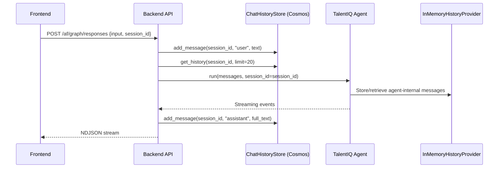
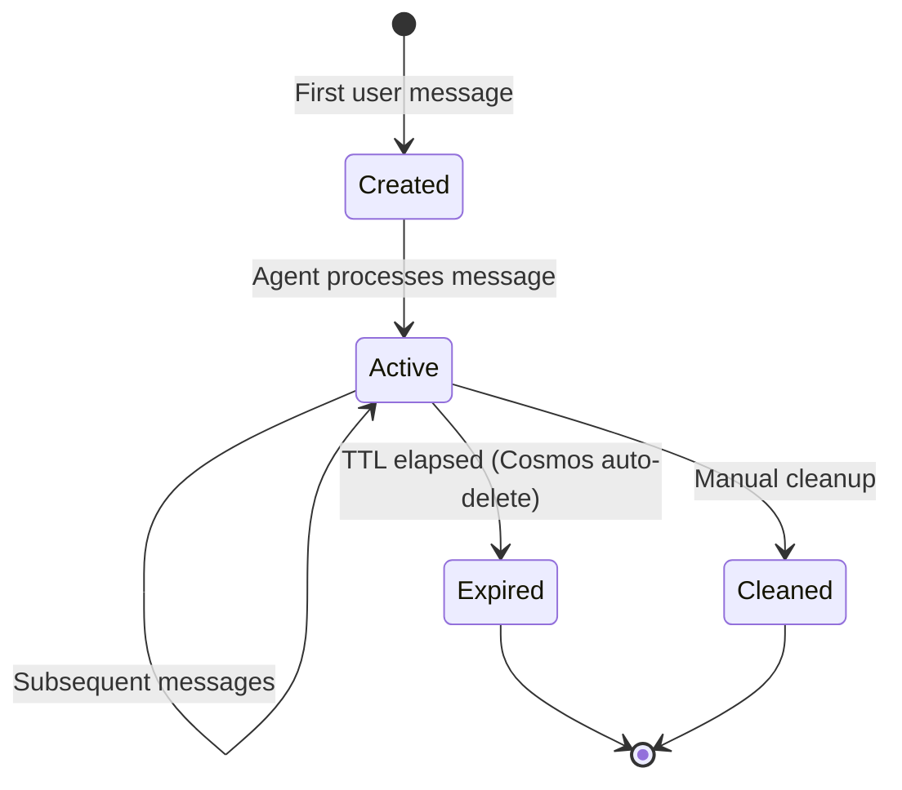

# Session Management Spec — In-Memory → Cosmos DB

**Author:** Kane (Backend Dev)  
**Date:** 2026-05-10  
**Status:** Living document  
**Source:** [talent_backend/talent_backend/agent/__init__.py](../../talent_backend/talent_backend/agent/__init__.py), [talent_backend/talent_backend/config.py](../../talent_backend/talent_backend/config.py)

---

## 1. Current State

### What Exists

Session management uses `InMemoryHistoryProvider` from `agent_framework`. Each agent gets its own provider instance.

```python
# agent/__init__.py
history_provider = InMemoryHistoryProvider()

document_agent = Agent(
    ...
    middleware=[history_provider],
)

query_agent = Agent(
    ...
    middleware=[InMemoryHistoryProvider()],  # separate instance
)
```

### Limitations

| Problem | Impact |
|---------|--------|
| Data lost on restart | Every server restart clears all agent conversation history |
| Single-instance only | Cannot scale to multiple backend instances — sessions are pinned to process |
| No TTL / cleanup | Memory grows unbounded with active sessions |
| No persistence | Agent can't resume a conversation after restart |
| Per-agent isolation | Each agent has its own history provider — triage can't review specialist history |

### Current Session Flow



Note: There are **two separate history mechanisms**:
1. **ChatHistoryStore** (Cosmos DB) — stores user-visible chat messages across API calls
2. **InMemoryHistoryProvider** (agent_framework) — stores agent-internal messages within a session (volatile)

---

## 2. Target State

### Cosmos DB-Backed Session Persistence

Replace `InMemoryHistoryProvider` with a custom `CosmosHistoryProvider` that stores agent session state in Cosmos DB.

### Container Design

**Container:** `sessions`  
**Partition key:** `/session_id`

#### Document Types

**Session Metadata:**
```json
{
    "id": "session_meta_abc123",
    "session_id": "abc123",
    "type": "session_meta",
    "user_id": "oid-from-entra",
    "created_at": "2026-05-10T10:00:00Z",
    "last_active_at": "2026-05-10T10:15:00Z",
    "agent_name": "triage_agent",
    "status": "active",
    "ttl": 86400
}
```

**Agent Conversation Entry:**
```json
{
    "id": "conv_abc123_triage_001",
    "session_id": "abc123",
    "type": "agent_history",
    "agent_name": "triage_agent",
    "role": "user",
    "content": "Find Python developers in Madrid",
    "timestamp": "2026-05-10T10:00:01Z",
    "sequence": 1,
    "ttl": 86400
}
```

#### Schema Details

| Field | Type | Purpose |
|-------|------|---------|
| `id` | string | Unique document ID |
| `session_id` | string | Partition key — groups all session data |
| `type` | string | `session_meta` or `agent_history` |
| `agent_name` | string | Which agent owns this history entry |
| `role` | string | `user`, `assistant`, `system`, `tool` |
| `content` | string | Message content |
| `sequence` | int | Ordering within agent conversation |
| `ttl` | int | Cosmos DB TTL in seconds (auto-delete) |

#### TTL Policy

| Environment | TTL | Notes |
|-------------|-----|-------|
| Development | 3600 (1 hour) | Fast cleanup during dev |
| Production | 86400 (24 hours) | Default session lifetime |
| Extended | 604800 (7 days) | For long-running engagements |

TTL is configurable via `SESSION_TTL_SECONDS` env var.

#### RU Budgeting

| Environment | Provisioning | RU/s | Notes |
|-------------|-------------|------|-------|
| Development | Manual | 400 | Minimum cost |
| Staging | Autoscale | 400-1000 | Scales with test load |
| Production | Autoscale | 400-4000 | Scales with concurrent users |

---

## 3. Custom HistoryProvider Implementation

```python
from agent_framework import HistoryProvider, Message

class CosmosHistoryProvider(HistoryProvider):
    """Cosmos DB-backed history for agent_framework sessions."""

    def __init__(self, container, ttl_seconds: int = 86400):
        self._container = container
        self._ttl = ttl_seconds

    async def get_history(
        self, session_id: str, agent_name: str, limit: int = 50
    ) -> list[Message]:
        """Retrieve agent conversation history from Cosmos."""
        query = (
            "SELECT c.role, c.content, c.sequence FROM c "
            "WHERE c.session_id = @sid AND c.agent_name = @agent "
            "AND c.type = 'agent_history' "
            "ORDER BY c.sequence ASC OFFSET 0 LIMIT @limit"
        )
        items = self._container.query_items(
            query=query,
            parameters=[
                {"name": "@sid", "value": session_id},
                {"name": "@agent", "value": agent_name},
                {"name": "@limit", "value": limit},
            ],
            partition_key=session_id,
        )
        return [Message(role=i["role"], contents=[i["content"]]) for i in items]

    async def add_message(
        self, session_id: str, agent_name: str, message: Message
    ) -> None:
        """Store an agent message in Cosmos."""
        # Get next sequence number
        seq = await self._next_sequence(session_id, agent_name)

        doc = {
            "id": f"conv_{session_id}_{agent_name}_{seq:04d}",
            "session_id": session_id,
            "type": "agent_history",
            "agent_name": agent_name,
            "role": message.role,
            "content": message.text,
            "timestamp": datetime.now(timezone.utc).isoformat(),
            "sequence": seq,
            "ttl": self._ttl,
        }
        self._container.upsert_item(doc)
```

---

## 4. Session Lifecycle



| Transition | Trigger | Action |
|-----------|---------|--------|
| Create | First message with new session_id | Write `session_meta` doc, initialize agent history |
| Resume | Message with existing session_id | Load session_meta, pass history to agent |
| Expire | Cosmos TTL | Automatic document deletion by Cosmos DB |
| Cleanup | Admin action or API call | Delete all docs with matching session_id |

### Resume Flow

```python
# On incoming request with existing session_id:
# 1. CosmosHistoryProvider.get_history() loads agent conversation
# 2. AgentSession created with session_id
# 3. Agent runs with full context from previous turns
# 4. New messages appended to Cosmos
```

---

## 5. Multi-Instance Support

### Current Problem

With `InMemoryHistoryProvider`, session state is local to the process. If two backend instances serve requests for the same session, they see different histories.

### Solution

Cosmos DB is the single source of truth. Any instance can serve any session:

```
┌──────────────┐  ┌──────────────┐  ┌──────────────┐
│ Instance A   │  │ Instance B   │  │ Instance C   │
│ (API + Agent)│  │ (API + Agent)│  │ (API + Agent)│
└──────┬───────┘  └──────┬───────┘  └──────┬───────┘
       │                 │                 │
       └─────────────────┼─────────────────┘
                         │
                    ┌────▼────┐
                    │ Cosmos  │
                    │ DB      │
                    └─────────┘
```

No sticky sessions required. Any instance reads/writes session state from Cosmos.

---

## 6. Migration Plan

### Feature Flag

```python
# config.py
SESSION_PROVIDER = os.getenv("SESSION_PROVIDER", "in_memory")  # "in_memory" or "cosmos"
SESSION_TTL_SECONDS = int(os.getenv("SESSION_TTL_SECONDS", "86400"))
```

### Phased Rollout

| Phase | SESSION_PROVIDER | Behavior |
|-------|-----------------|----------|
| 1 (Current) | `in_memory` | InMemoryHistoryProvider (no change) |
| 2 (Dev test) | `cosmos` | CosmosHistoryProvider with fallback to in-memory |
| 3 (Production) | `cosmos` | CosmosHistoryProvider, in-memory disabled |

### Orchestrator Changes

```python
# agent/__init__.py — initialize()
if SESSION_PROVIDER == "cosmos":
    from talent_backend.session import CosmosHistoryProvider
    history_provider = CosmosHistoryProvider(
        container=cosmos_session_container,
        ttl_seconds=SESSION_TTL_SECONDS,
    )
else:
    history_provider = InMemoryHistoryProvider()

# All agents share the same provider instance
document_agent = Agent(..., middleware=[history_provider])
query_agent = Agent(..., middleware=[history_provider])
cv_agent = Agent(..., middleware=[history_provider])
triage_agent = Agent(..., middleware=[history_provider])
```

Key change: all agents share **one** history provider instance (currently they each get their own). This enables the triage agent to see specialist agent history within the same session.

---

## 7. Error Handling

### Graceful Degradation

```python
class CosmosHistoryProvider(HistoryProvider):
    def __init__(self, container, ttl_seconds, fallback=True):
        self._fallback_store = {} if fallback else None

    async def get_history(self, session_id, agent_name, limit=50):
        try:
            return await self._cosmos_get(session_id, agent_name, limit)
        except Exception as e:
            logger.warning("Cosmos session read failed — using fallback: %s", e)
            if self._fallback_store is not None:
                return self._fallback_get(session_id, agent_name, limit)
            return []  # stateless mode
```

| Failure | Behavior |
|---------|----------|
| Cosmos unavailable at startup | Fall back to in-memory, log warning |
| Cosmos unavailable mid-session | Return cached messages if available, log warning |
| Session not found | Create new session (no error) |
| Write failure | Log warning, agent continues without persistence |
| TTL expiry during active session | Session data silently deleted — next request creates fresh session |

---

## 8. Config Additions

| Variable | Default | Purpose |
|----------|---------|---------|
| `COSMOS_SESSION_ENDPOINT` | (same as `COSMOS_CHAT_ENDPOINT`) | Cosmos endpoint for session store |
| `COSMOS_SESSION_DATABASE` | `talent_db` | Database name |
| `COSMOS_SESSION_CONTAINER` | `sessions` | Container name |
| `SESSION_PROVIDER` | `in_memory` | Feature flag: `in_memory` or `cosmos` |
| `SESSION_TTL_SECONDS` | `86400` | TTL for session documents |

Note: Session store may share the same Cosmos account as chat history but uses a separate container for isolation.

---

## 9. Relationship to Chat History

| Concern | Chat History (`chat_history.py`) | Session Management |
|---------|----------------------------------|-------------------|
| Purpose | User-visible conversation record | Agent-internal conversation state |
| Stored by | API layer | Agent framework middleware |
| Contains | User + assistant messages | User, assistant, system, tool messages |
| Partition | `/session_id` | `/session_id` |
| Container | `chat_history_db` | `sessions` |
| TTL | None (permanent) | Configurable (default 24h) |

Chat history is the **permanent record** of what the user saw. Session management is the **working memory** for the agent during active conversations.
